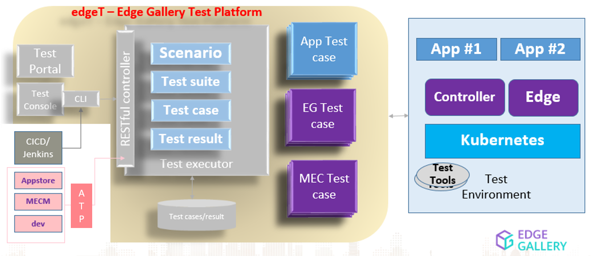

#边T

**Edge Gallery 测试平台**

# 介绍
用于管理、执行、运行测试用例的微服务（在不同的运行时开发，如 java、python、go、script、ROBOT、docker 等）并带有仪表板来分析结果。它可以与其他边缘画廊服务集成。帮助开发测试用例一次（由社区或合作伙伴或运营商或应用程序开发人员）在各个 DevOps 阶段使用它，包括 CICD、应用程序开发、用于用户服务验证的生产部署等作为所有测试的一个平台。

# 建筑学

## 测试执行器

它以适当的敏捷性和可扩展性促进了测试流程的执行和测试用例的执行。每个测试用例都与所需的实现一起建模到 YAML 中，这可以使用不同的脚本语言（如 bash 脚本、python 脚本）或编程语言（如 java）完成。

## RESTful 控制器

它提供了 RESTful 控制器来管理测试用例、测试流程并执行它们。

# 领域模型
## 设想

场景是一个逻辑实体，用于对任何给定的测试用例进行建模，例如：合规性和验证。

## 测试套件

测试套件是一个逻辑实体，有助于使用符号 x.y.z 将测试分组到层次结构中

## 测试用例

测试用例使用所需的输入和输出对给定的真实测试用例进行建模。

## 执行

执行使用唯一标识符对给定测试用例的每次执行进行建模

## 轮廓

配置文件对系统配置和预定义的测试用例参数进行建模。例如：GSMA 配置文件

# 如何构建
``
./build-all.sh
``

# 如何安装
``
导出 TEST_NAME=feature2
./start.sh

# 去测试
./后端/测试/测试.sh
``

# 如何卸载
``
./stop.sh
``

# 文档

* [swagger api](./backend/docs/swagger.md)

* [测试用例开发指南](./testcases/docs/testcase-dev-guide.md)

* [测试用例部署指南](./testcases/docs/testcase-dep-guide.md)

* [示例 REST API](./backend/docs/api-req-res-sample.md)